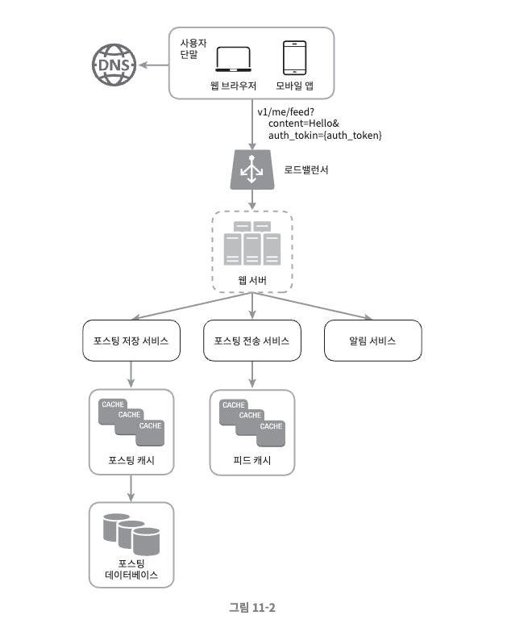
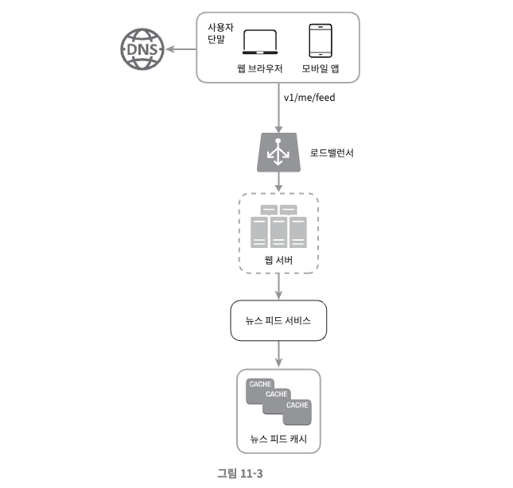
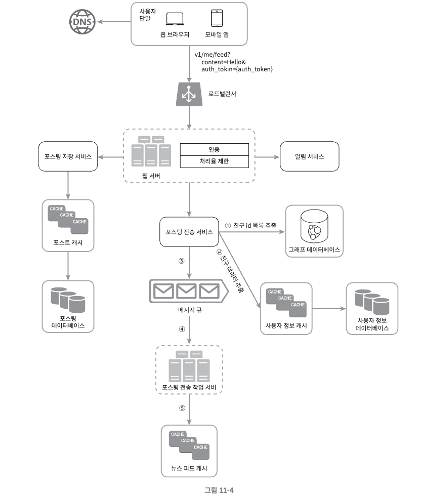
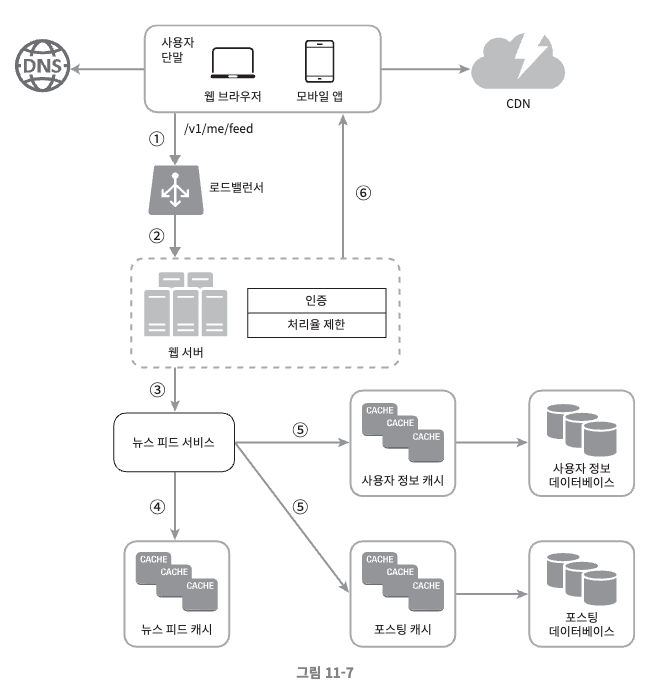
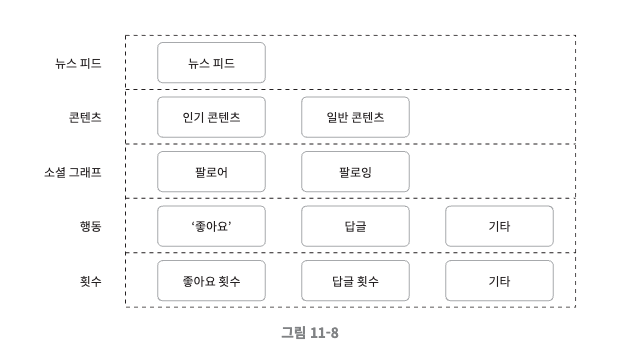

# 11장. 뉴스 피드 시스템 설계

 

## 1단계. 문제 이해 및 설계 범위 확정

### 요구사항 파악

- 모바일 앱과 웹 둘다 지원
- 사용자는 뉴스피드 페이지에 새로운 스토리를 올리고, 친구들이 올리는 스토리를 볼 수 있는 기능 필요
- 뉴스피드 표시 순서는 시간 흐름 역순으로 표시된다고 가정
- 한 명의 사용자는 최대 5000명의 친구를 가질 수 있음
- 트래픽 규모는 매일 천만 명이 방문한다고 가정
- 피드는 이미지나 비디오 스토리 등의 미디어 파일이 포함될 수 있음

   

## 2단계. 개략적 설계안 제시 및 동의 구하기

- 피드 발행
    - 사용자가 스토리를 포스팅하면 해당 데이터를 캐시와 데이터베이스에 기록하고, 새 포스팅은 친구의 뉴스피드에도 전송된다.
- 뉴스 피드 생성
    - 지면 관계상 뉴스 피드는 모든 친구의 포스팅을 시간 흐름 역순으로 모아서 만든다고 가정한다.

  

### 뉴스 피드 API

뉴스 피드 API는 클라이언트가 서버와 통신하기 위해 사용하는 수단이다. HTTP 프로토콜 기반이고, 상태 정보를 업데이트하거나, 뉴스 피드를 가져오거나, 친구를 추가하는 등의 다양한 작업을 수행하는 데 사용한다.

 

**피드 발행 API**

- 새 스토리를 포스팅하기 위한 API는 HTTP POST 형태로 요청을 보낸다.
- POST /v1/me/feed
- 인자
    - body : 포스팅 내용
    - Authorization 헤더 : API 호출을 인증하기 위해 사용

 

**피드 읽기 API**

- 뉴스 피드를 가져오는 API
- GET /v1/me/feed
- 인자
    - Authorization 헤더 : API 호출을 인증하기 위해 사용

  

### 피드 발행

피드 발행 시스템의 개략적 형태는 다음과 같다.

- 사용자 : 모바일 앱이나 브라우저에서 새 포스팅을 올리는 주체
- 로드밸런서 : 트래픽을 웹 서버들로 분산한다.
- 웹 서버 : HTTP 요청을 내부 서비스로 중계하는 역할 담당
- 포스팅 저장 서비스 : 새 포스팅을 데이터베이스와 캐시에 저장
- 포스팅 전송 서비스 : 새 포스팅을 친구의 뉴스 피드에 푸시. 뉴스 피드 데이터는 캐시에 보관하여 빠르게 읽어갈 수 있도록 한다.
- 알림 서비스 : 친구들에게 새 포스팅이 올라왔음을 알리거나, 푸시 알림을 보내는 역할 담당

  

### 뉴스 피드 생성

- 사용자 : 뉴스 피드를 읽는 주체
- 로드밸런서 : 트래픽을 웹 서버들로 분산
- 웹 서버 : 트래픽을 뉴스 피드 서비스로 보낸다.
- 뉴스 피드 서비스 : 캐시에서 뉴스 피드를 가져오는 서비스
- 뉴스 피드 캐시 : 뉴스 피드를 렌더링할 때 필요한 피드 ID를 보관한다.

   

## 3단계. 상세 설계

### 피드 발행 흐름 상세 설계

**웹 서버**

- 웹 서버는 클라이언트와 통신할 뿐만 아니라 인증이나 처리율 제한 등의 기능도 수행한다.
- 올바른 인증 토큰을 Authorization 헤더에 넣고 API를 호출하는 사용자만 포스팅을 할 수 있어야 한다.
- 스팸을 막고 유해한 콘텐츠가 자주 올라오는 것을 방지하기 위해서 특정 기간 동안 한 사용자가 올릴 수 있는 포스팅의 수에 제한을 두어야 한다.

  

**포스팅 전송(팬아웃) 서비스**

- 어떤 사용자의 새 포스팅을 그 사용자와 친구 관계에 있는 모든 사용자에게 전달하는 과정
- **쓰기 시점에 팬아웃하는 모델 (push 모델)**
    - 새로운 포스팅을 기록하는 시점에 뉴스 피드를 갱신하게 된다. 즉, 포스팅이 완료되면 바로 해당 사용자의 캐시에 해당 포스팅을 기록한다.
    - **장점**
        - 뉴스 피드가 실시간으로 갱신되며 친구 목록에 있는 사용자에게 즉시 전송 된다.
        - 새 포스팅이 기록되는 순간에 뉴스 피드가 이미 갱신되므로 뉴스 피드를 읽는 데 드는 시간이 짧아진다.
    - **단점**
        - 친구가 많은 사용자의 경우 친구 목록을 가져오고 그 목록에 있는 사용자 모두의 뉴스 피드를 갱신하는 데 많은 시간이 소요될 수도 있다. 핫키(hotkey) 문제
        - 서비스를 자주 이용하지 않는 사용자의 피드까지 갱신해야 하므로 컴퓨팅 자원이 낭비된다.
- **읽기 시점에 팬아웃하는 모델 (pull 모델)**
    - 피드를 읽어야 하는 시점에 뉴스 피드를 갱신한다. 따라서 요청 기반(on-demand) 모델이다. 사용자가 본인 홈페이지나 타임라인을 로딩하는 시점에 새로운 포스트를 가져오게 된다.
    - **장점**
        - 비활성화된 사용자, 또는 서비스에 거의 로그인하지 않는 사용자의 경우에는 로그인하기까지는 어떤 컴퓨팅 자원도 소모하지 않기 때문에 이 모델이 유리하다.
        - 데이터를 친구 각각에 푸시하는 작업이 필요 없으므로 핫키 문제도 생기지 않는다.
    - **단점**
        - 뉴스 피드를 읽는 데 많은 시간이 소요될 수 있다.

 

> **본 설계안의 경우에는 이 두 가지 방법을 결합하여 장점은 취하고 단점은 버리는 전략을 취하도록 한다.**
> 
- 뉴스피드를 빠르게 가져올 수 있도록 하는 것은 중요하기 때문에 대부분의 사용자에 대해서는 푸시 모델을 사용한다.
- 친구나 팔로어가 아주 많은 사용자의 경우에는 팔로어로 하여금 해당 사용자의 포스팅을 필요할 때 가져가도록 하는 풀 모델을 사용하여 시스템 과부하를 방지한다.
- 안정 해시를 통해 요청과 데이터를 보다 고르게 분산하여 핫키 문제를 줄인다.

  

### 피드 읽기 흐름 상세 설계

뉴스 피드를 읽는 과정 전반의 상세 설계안은 그림 11-7과 같다.

- 이미지나 비디오와 같은 미디어 콘텐츠는 CDN에 저장하여 빨리 읽어갈 수 있도록 하였다.
    1. 사용자가 뉴스 피드를 읽으려는 요청을 보낸다. 요청은 /v1/me/feed 로 전송된다.
    2. 로드 밸런서가 요청을 웹 서버 가운데 하나로 보낸다.
    3. 웹 서버는 피드를 가져오기 위해 뉴스 피드 서비스를 호출한다.
    4. 뉴스 피드 서비스는 뉴스 피드 캐시에서 포스팅 ID 목록을 가져온다.
    5. 뉴스 피드에 표시할 사용자 이름, 사용자 사진, 포스팅 콘텐츠, 이미지 등을 사용자 캐시와 포스팅 캐시에서 가져와 완전한 뉴스 피드를 만든다.
    6. 생성된 뉴스 피드를 JSON 형태로 클라이언트에게 보낸다. 클라이언트는 해당 피드를 렌더링한다.

  

### 캐시 구조

캐시는 뉴스 피드 시스템의 핵심 구조로, 본 설계안은 그림 11-8과 같이 캐시를 다섯 계층으로 나눈다

- 뉴스 피드 : 뉴스 피드의 ID를 보관한다.
- 콘텐츠 : 포스팅 데이터를 보관한다. 인기 콘텐츠는 따로 보관한다.
- 소셜 그래프 : 사용자 간 관계 정보를 보관한다.
- 행동(action) : 포스팅에 대한 사용자의 행위에 관한 정보를 보관한다. 포스팅에 대한 ‘좋아요’, 답글 등등이 이에 해당한다.
- 횟수(counter) : ‘좋아요’ 횟수, 응답 수, 팔로어 수, 팔로잉 수 등의 정보를 보관한다.

   

## 4단계. 마무리

이번 장에서는 뉴스 피드 시스템을 설계해 보았다. 이번 설계안은 뉴스 피드 발행과 생성의 두 부분으로 구성되어 있다. 

설계에는 정답은 없으며, 회사마다 독특한 제약이나 요구조건이 있기 때문에, 시스템을 설계할 때는 그런 점을 고려해야만 한다. 설계를 진행하고 기술을 선택할 때는 그 배경에 어떤 타협적 결정(trade-off)들이 있었는지 잘 이해하고 설명할 수 있어야 한다. 

설계를 마친 후에도 시간이 남는다면 추가적으로 규모 확장성 이슈를 논의할 수 있다.

 

- 데이터베이스 규모 확장
    - 수직적 규모 확장 vs 수평적 규모 확장
    - SQL & NoSQL
    - 주-부(master-slave) 다중화
    - 복제본에 대한 읽기 연산
    - 일관성 모델
    - 데이터베이스 샤딩

 

이 외에도 논의해 보면 좋을 만한 주제로는 다음과 같은 것이 있다.

- 웹 계층을 무상태로 운영하기
- 가능한 한 많은 데이터를 캐시할 방법
- 여러 데이터 센터를 지원할 방법
- 메시지 큐를 사용하여 컴포넌트 사이의 결합도 낮추기
- 핵심 메트릭에 대한 모니터링, 예를 들어 트래픽이 몰리는 시간대의 QPS, 사용자가 뉴스 피드를 새로고침 할 때의 지연시간 등